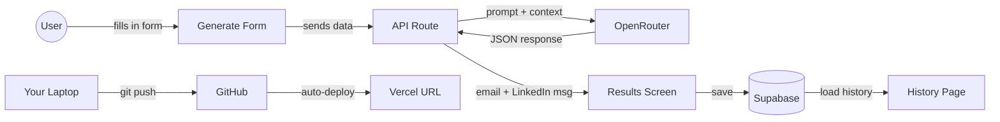
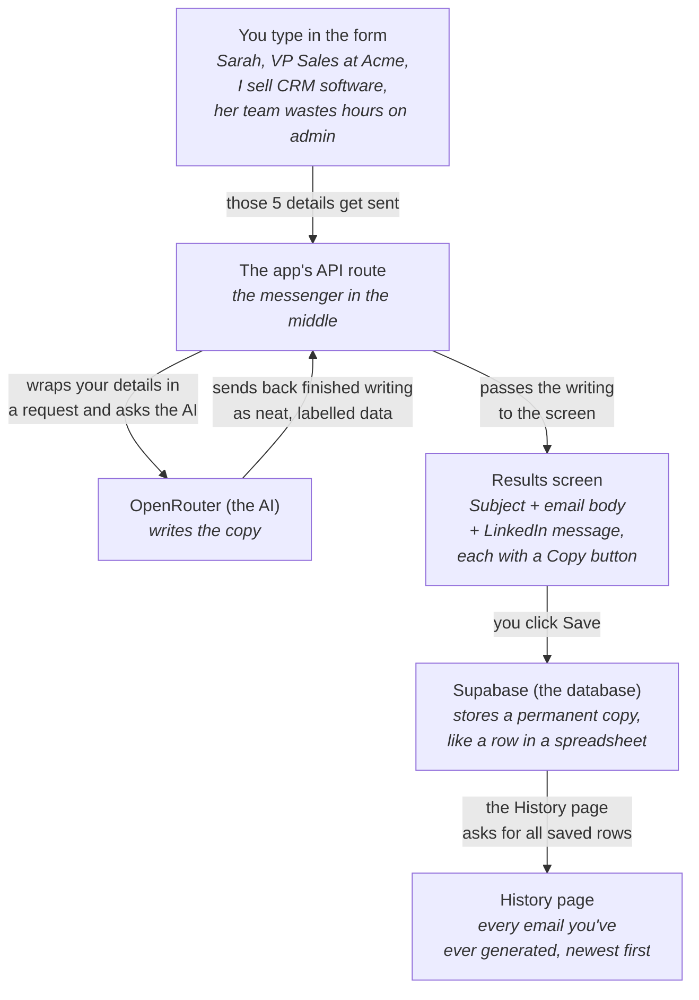
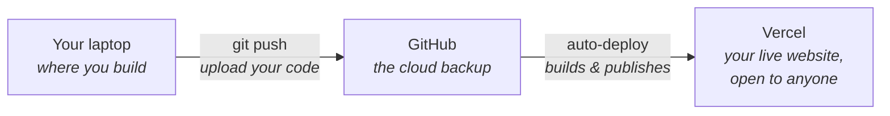

# buildAcademy Student Manual

**What we're building:** An AI-powered sales outreach generator
**Format:** 3 live online evenings (Google Meet) -- Tue 6:00-8:00pm AEST
**Dates:** Tue 23 Jun, Tue 30 Jun, Tue 7 Jul

Same app, same skills as a single-day build -- spread over three weeks so each layer
has room to land. Week 1 we plan and scaffold, Week 2 we connect the database and the
AI, Week 3 we debug and ship it live.

---

## Before the Cohort -- Setup

Follow the setup video and the steps below before Week 1 so the three Tuesdays are
pure building -- not a minute spent on installs. The goal is a build-ready laptop.

Complete these before Week 1:

1. **Install Cursor** -- go to cursor.com, download and install it, and sign up for a Pro subscription (or start a free trial)
2. **Create these accounts** (all free):
  - **GitHub** -- github.com
  - **Vercel** -- vercel.com (sign up with your GitHub account)
  - **Supabase** -- supabase.com
  - **OpenRouter** -- openrouter.ai (add $5 credit -- this will last you weeks beyond the cohort)

Then connect your tools (next section) so the Cursor agent can drive everything from
night one.

---

## Connect Your Tools (before Week 1)

Throughout buildAcademy we lean on one core skill: **using the Cursor agent to do the
actual work** -- installing tools, running commands, and making the real changes to
your app. You describe what you want in plain English; the agent executes it. We start
practising right now by connecting the two services you'll use all cohort -- **GitHub**
(where your code lives) and **Supabase** (your database). There's more on both in *The
Tech Stack* below; for now the point is just to get them talking to Cursor, because
these are the same skills you'll use to build and ship later.

### 1. Pull this manual from GitHub (your first agent prompt)

Open Cursor, open a new agent chat (Cmd+L on Mac, Ctrl+L on Windows), and paste this:

```
Check whether Node.js and Git are installed on this machine, and install whichever
is missing (use Homebrew on Mac -- installing Homebrew first if needed; on Windows
download Node.js from nodejs.org and Git from git-scm.com).
Then clone the public repo https://github.com/callumholt/buildAcademy.git onto my
Desktop and open it in Cursor.
Tell me the installed version of Node.js and Git when you're done.
```

If the agent reports a version for Node.js and Git and the project opens in Cursor,
your GitHub connection works -- you've just pulled real code down from the internet by
asking in plain English. Keep this manual open in Cursor as your reference for all
three weeks.

### 2. Connect Supabase to Cursor (MCP)

MCP is what lets the Cursor agent talk directly to Supabase -- so later it can create
your database tables and read your data for you, without you leaving Cursor. We'll set
it up the buildAcademy way: by asking the agent to do it.

**First, log in to Supabase in your browser** (open supabase.com and sign in). With
that already done, the approval step later is a single click instead of a full login
in a small popup window.

**Step 1 -- let the agent add the MCP server.** In an agent chat, paste this:

```
Add the Supabase MCP server to my Cursor configuration. Edit (or create) the file at
~/.cursor/mcp.json and add an MCP server named "supabase" with the URL
https://mcp.supabase.com/mcp. Keep any servers already in the file exactly as they
are, and make sure the final file is valid JSON. Show me the file when you're done.
```

The agent writes the small config file for you -- this is the same file Cursor opens if
you click **Settings → Cursor Settings → Tools & MCP → New MCP Server**, just without
you having to hand-edit any JSON.

**Step 2 -- connect (log in).** Open **Settings → Cursor Settings → Tools & MCP**. You'll
see **supabase** in the list with an amber dot and **"Needs authentication"**, plus a
**Connect** button. Click **Connect** -- a browser window opens. Log in to Supabase if
asked, then on the **Authorize Cursor** screen **select your organization** from the
dropdown (if you just made your account, there's one default org) and click the green
**Authorize Cursor**. Leave the permissions as they are -- they include Database
read + write, which is exactly what we need. It uses a secure login, so there are no
tokens to copy or paste. (If **supabase** doesn't appear yet, fully quit and reopen
Cursor, since MCP servers load when Cursor starts.)

**Step 3 -- confirm it's connected.** The dot next to **supabase** turns green once
you've approved. Then test it in an agent chat:

```
Using the Supabase MCP, list my Supabase projects and any tables in them.
If I don't have a project yet, just confirm that you can see my Supabase account.
```

If the agent can see your Supabase account, you're connected -- and you've just given
Cursor a direct line to your database. (Official step-by-step, in case the screens look
different: [https://supabase.com/docs/guides/getting-started/mcp](https://supabase.com/docs/guides/getting-started/mcp))

> Seeing a red dot or an error on the Supabase MCP? That's the most common setup snag
> -- jump to the **Troubleshooting** section at the bottom of this manual.

Stuck on any of this? Reply to the setup email and we'll sort it out before Week 1.

---

## Each Night (Google Meet)

We'll send you the Meet link beforehand, so you're all set -- just click it to join.
The link opens at **5:30pm** each night -- 30 minutes early -- so you can test your
audio, video, and screen-share before we start. Cameras on: this is a cohort, not a
lecture. We start at 6:00pm sharp.

---

## The Tech Stack

Here's what each tool does, in plain English:


| Tool           | What it does                                                                                                                             |
| -------------- | ---------------------------------------------------------------------------------------------------------------------------------------- |
| **Cursor**     | Your AI building partner. You describe what you want in English, it writes the code.                                                     |
| **Next.js**    | The framework -- the structure your app is built on. Like the framing of a house.                                                        |
| **Supabase**   | Your database -- where your app stores information. Like a spreadsheet your app can read and write to.                                   |
| **MCP**        | The bridge -- lets Cursor talk directly to Supabase, so the agent can create tables and manage your database without you leaving Cursor. |
| **GitHub**     | Your save file -- keeps a history of every version of your code. Like Google Docs version history.                                       |
| **Vercel**     | Your hosting -- puts your app on the internet so anyone can visit it.                                                                    |
| **OpenRouter** | Your AI access -- one key that connects to any AI model (Claude, GPT, etc.)                                                              |


---

## Three Habits That Will Save You

Keep these in mind every night. These three are what YouTube won't teach you -- they
map to the three ways people get stuck with AI tools (the fix spiral, the planning
gap, the deployment cliff).

1. **The Checkpoint Rule** -- Before we start anything new, we commit and push to GitHub. It's a save point. If the next thing breaks, we go back to here.
2. **The Reset Rule** -- If Cursor starts spiralling (fixing one thing and breaking another), we stop, revert to the last checkpoint, and try a different prompt. We never chase a fix spiral.
3. **One thing at a time** -- We never ask Cursor to do five things at once. One feature, one prompt, one test.

---

## What We're Building

Our app does one thing: you type in who you're reaching out to and why, and it gives you a personalised cold email and LinkedIn message.

### Why this app?

This project is deliberately simple, but it covers every fundamental skill you need to build real software:

- **A frontend UI** -- the form and results screens are what the user actually sees and interacts with. Every app starts here.
- **An AI integration** -- the app sends a request to an AI provider (OpenRouter), receives structured data back, and does something useful with it. This is the same pattern behind every AI-powered product.
- **A database** -- the app writes data to Supabase and reads it back. Storing and retrieving information from a permanent data store is the backbone of any application that remembers anything. This is effectively google sheets or microsoft excel, and infact those software packages can even be used as a data store.
- **Version control** -- pushing code to GitHub means your work is backed up in the cloud and you can always go back to a previous version. This is how every professional development team works. It also means if your laptop blows up, you can just get a new laptop and connect to github and continue on from where you left it. Github is like a library or a book, it stores your code, but it doesn't run your code.
- **Deployment** -- connecting to Vercel takes your app from "running on my laptop" to "live on the internet with a real URL." This is the step most people skip when learning, and it's the step that makes everything real. Vercel runs ontop of AWS and is effectively an 'always on computer' that runs your code just like localhost:3000 does on your local machine.

By the end of three weeks you'll have touched every layer of a modern web application. The app itself is useful, but the real value is understanding how these pieces fit together -- because every app you build after this uses the same architecture.

### How it all fits together




### Following the data, step by step

Same journey as above, but this time watch the actual information move. Think of it like
filling in a form, handing it to an assistant, and getting a finished letter back.




**What's actually moving at each arrow:**

1. **You → API route:** the 5 things you typed (name, company, role, your offer, their pain point)
2. **API route → AI:** those details wrapped in instructions ("write a cold email and a LinkedIn message")
3. **AI → API route:** the finished writing, sent back as labelled data (`email_subject`, `email_body`, `linkedin_message`)
4. **API route → screen:** the writing, shown to you with Copy buttons
5. **Screen → database:** when you hit Save, everything (your inputs + the AI's outputs) is stored permanently
6. **Database → History page:** the History page reads everything back out so you can see all your past work




Your code travels separately: you push it to GitHub (the backup), and Vercel automatically
turns that into a live website. Every time you push, the live site updates itself.

**Three screens:**

- **Generate** -- a form where you enter the prospect's details
- **Results** -- displays the AI-generated email and LinkedIn message
- **History** -- shows all your saved outreach entries

We'll design the database table in Week 1 and write the AI prompt in Week 2 -- where
each one is actually used.

---

## Build Order

This is the checklist for the whole cohort. After every step, we commit and push to GitHub. The arrows show where each week lands.

```
WEEK 1 -- Scope & Scaffold
0. Scope the app (on paper -- no code yet)
1. Create the Next.js project + connect to GitHub       → CHECKPOINT
2. Build the Generate form (5 fields + button)           → CHECKPOINT

WEEK 2 -- Database & AI
3. Set up Supabase (MCP + table + secret keys)           → CHECKPOINT
4. Build the API route (connect form to OpenRouter)      → CHECKPOINT
5. Build the Results screen (email + LinkedIn display)   → CHECKPOINT
6. Add "Save to History" (write to Supabase)             → CHECKPOINT

WEEK 3 -- Debug & Ship
7. Build the History page (read from Supabase)           → CHECKPOINT
8. Deploy to Vercel                                      → CHECKPOINT (final)
```

---

# WEEK 1 -- Scope & Scaffold

**End state tonight:** a scoped plan for the app, a running Next.js project, and the Generate form on screen at localhost:3000.

## Step 0: Scope the App (before any code)

This is the most important step of the whole cohort -- and the one most people skip.
Anyone can ask an AI to "build me an app". The people who actually ship are the ones
who scope first: they decide exactly what they're building before they prompt. AI
removed the hard part of *writing* the code. It did not remove the hard part of
*deciding what to build* -- that's now your job, and it's the skill that lets you walk
away from this cohort and build your own thing.

### The SCOPE framework

Five questions, one word: **SCOPE**. Write them down -- they work for **any** app you
ever build, not just this one:

- **S -- Solve:** who are you solving the problem for? (the user)
- **C -- Challenge:** what specific problem does the app solve? (the job)
- **O -- One thing:** what's the one thing that, if it didn't work, makes the whole app pointless? (the core -- protect this above all)
- **P -- Path:** where does the information come from, and where does it need to end up? (inputs → outputs → storage)
- **E -- Exclude:** what will you deliberately leave for later? (the cuts -- this is how you actually ship)

### Our app, scoped

Here's the framework applied to the app we're building together:

- **For:** someone doing cold outreach -- a founder, salesperson, or recruiter
- **Problem:** writing personalised cold emails and LinkedIn messages is slow
- **Core:** the generated copy must be good and personalised. If that fails, nothing else matters.
- **Info:** user types prospect details → AI generates copy → we save it to a database → they read it back in history
- **Later (out of scope):** login, payments, multiple users. We name these so we stop trying to build everything at once.

> **Scope is not a limitation -- it's the skill. Naming what you're NOT building is how anything ever ships.**

### From scope to structure

**Path** (inputs → outputs → storage) turns straight into the table our app needs.
This is what "thinking in data" looks like:

```
Table: outreach
-----------------------------------------
id              | uuid (auto-generated)
prospect_name   | text
company         | text
role            | text
offer           | text
pain_point      | text
email_subject   | text
email_body      | text
linkedin_message| text
created_at      | timestamp (auto-generated)
-----------------------------------------
```

- The first five columns are what you type in (**inputs**)
- The next three are what the AI generates (**outputs**)
- The last two are automatic (the database handles them)

We save the inputs next to the outputs so your history shows *who* you wrote to and
*why*, not just the text. We'll build this table for real in Week 2.

Keep the SCOPE framework -- it's the move you'll repeat for every app you build after
this cohort. Tonight we put it to work on the app we're all building together.

## Step 1: Create the Project + Connect to GitHub

### Create the project

1. Open Cursor
2. Open a new agent chat (Cmd+L on Mac, Ctrl+L on Windows)
3. Type this prompt:

```
Create a new Next.js project called "outreach-generator" on my Desktop.
Use TypeScript, Tailwind CSS, and the App Router.
After creating it, open the project folder and start the dev server.
```

1. Wait for the agent to finish
2. Start the app by prompting it with `start the app` . Then open your browser to [http://localhost:3000](http://localhost:3000) -- that's your app running

### Key files to know

- `app/page.tsx` -- this is what you see in the browser. We'll replace it.
- `app/layout.tsx` -- this wraps every page. Think of it as the frame around every screen.
- `.env.local` -- this is where we'll put our secret keys. This file never gets uploaded to GitHub.

### Connect to GitHub

No clicking around github.com -- the agent can create the repository *and* push your
code for you using the GitHub CLI. In the agent chat:

```
Put this project on GitHub using the GitHub CLI (gh):
1. If the GitHub CLI (gh) isn't installed, install it (Homebrew on Mac, or the
   official installer on Windows).
2. If I'm not logged in to GitHub yet, run "gh auth login" and walk me through it --
   choose GitHub.com over HTTPS and authenticate in the browser when it opens.
3. Commit all current changes with the message "initial project setup".
4. Create a new PRIVATE GitHub repo called "outreach-generator" from this project,
   add it as the "origin" remote, and push to the main branch.
```

The first time you run this, a browser window opens to log in to GitHub -- approve it
and the agent does the rest. When it finishes, your code is on GitHub (open the repo
link it gives you to check). Logging in here also means every future `git push` just
works -- no logging in again.

---

## Step 2: Build the Generate Form

In Cursor's agent chat:

```
Replace the contents of app/page.tsx with a clean outreach email generator form.

The form should have these fields:
- Prospect Name (text input)
- Company (text input)
- Their Role (text input)
- Your Offer / What You Do (textarea)
- Pain Point / Reason for Reaching Out (textarea)

And a large "Generate" button at the bottom.

Use Tailwind CSS for styling. Make it look professional -- centered on the page,
clean spacing, subtle shadows. The page title should be "Outreach Generator".

The form should not submit yet -- just build the UI.
```

Review and accept the changes. Check the browser -- the form should be there.

**CHECKPOINT:** In the agent chat: `Commit all changes with the message 'add generate form' and push to GitHub`

### Homework (Week 1 → Week 2)

1. Make sure the project still runs after you reopen Cursor.
2. Make the form yours -- change the title, colours, and add placeholder example text in the fields, using one Cursor prompt at a time and committing after each.
3. Confirm the Supabase MCP shows a green dot in Cursor (**Settings → Cursor Settings → Tools & MCP**); if not, click **Connect** to reconnect.
4. Post a screenshot of your form in the community.

---

# WEEK 2 -- Database & AI

**End state tonight:** Supabase connected, the AI generating real personalised copy, results displayed on screen, and Save-to-History working.

## Step 3: Set Up Supabase + MCP + Secret Keys

### Part A: Confirm the Supabase MCP is connected

You connected the Supabase MCP back in setup, so the agent can already talk to your
Supabase account. Quick check: open **Settings → Cursor Settings → Tools & MCP** and
make sure the dot next to **supabase** is green. If it says **"Needs authentication,"**
click **Connect** and approve access. (If you skipped setup, follow *Before the Cohort →
Connect Supabase to Cursor (MCP)* near the top of this manual.)

### Part B: Create the Supabase project

Because the agent can talk to Supabase, let it create the project for you. In the agent chat:

```
Using the Supabase MCP, create a new Supabase project called "outreach-generator"
in my organization, in the region closest to me. Let me know when it's ready.
```

Wait ~2 minutes for it to provision. (Prefer to do it by hand? Go to supabase.com →
**New project**, name it `outreach-generator`, pick the closest region, and save the
database password somewhere safe.)

### Part C: Create the database table

In Cursor's agent chat:

```
Using Supabase MCP, create a table called "outreach" in my Supabase project
with the following columns:

- id: uuid, primary key, default gen_random_uuid()
- prospect_name: text
- company: text
- role: text
- offer: text
- pain_point: text
- email_subject: text
- email_body: text
- linkedin_message: text
- created_at: timestamptz, default now()

Disable Row Level Security on this table for now.
```

After it completes, check your Supabase dashboard (Table Editor) to verify the table is there.

### Part D: Set up environment variables

Two different connections: the MCP connection (set up earlier) lets Cursor *manage* your database while you build; the Project URL + anon key let the *app itself* read and write at runtime. You need both.

1. In Supabase, go to **Settings** then **API** -- copy the **Project URL** and **anon key**
2. Go to openrouter.ai, then **Keys** -- copy your API key
3. In Cursor's agent chat:

```
Set up Supabase and environment variables in this project:

1. Create a .env.local file with these values:
   NEXT_PUBLIC_SUPABASE_URL=<paste-your-supabase-url>
   NEXT_PUBLIC_SUPABASE_ANON_KEY=<paste-your-anon-key>
   OPENROUTER_API_KEY=<paste-your-openrouter-key>

2. Install the @supabase/supabase-js package

3. Create a file at lib/supabase.ts that creates and exports a Supabase client
   using those environment variables
```

After this, restart the dev server so Next.js picks up the new environment variables. In the agent chat: `Stop the dev server and start it again`

**CHECKPOINT:** In the agent chat: `Commit all changes with the message 'set up supabase and env vars' and push to GitHub`

---

## Step 4: Build the API Route + AI Integration

This is the heart of the app: the API route takes the form details, sends them to the
AI with a carefully written prompt, and gets back structured copy. Here's the prompt
we're building around -- notice it asks for **JSON** so the code can reliably split the
subject, body, and LinkedIn message apart:

```
You are an expert B2B copywriter.

Write two pieces of outreach copy for the following context:

Prospect: [name] -- [role] at [company]
What we offer: [your_offer]
Their likely pain point: [pain_point]

Output:
1. A cold email with a subject line. Keep it under 150 words.
   Conversational, not salesy. End with one clear CTA.
2. A LinkedIn connection message. Under 300 characters.
   Warm, human, specific.

Format your response as JSON:
{
  "email_subject": "",
  "email_body": "",
  "linkedin_message": ""
}
```

Now build it. In the agent chat:

```
I need to add AI-powered email generation to this app. Do the following:

1. Create a Next.js API route at app/api/generate/route.ts that:
   - Accepts a POST request with JSON body containing:
     prospect_name, company, role, offer, pain_point
   - Calls the OpenRouter API (https://openrouter.ai/api/v1/chat/completions)
     using the OPENROUTER_API_KEY environment variable
   - Uses the model "anthropic/claude-sonnet-4-20250514"
   - Sends this system prompt: "You are an expert B2B copywriter. Always
     respond with valid JSON only, no markdown."
   - Sends a user prompt that includes all five fields and asks for a cold
     email (subject + body, under 150 words, conversational, one clear CTA)
     and a LinkedIn message (under 300 characters, warm and specific)
   - Requests the response in JSON format:
     { "email_subject": "", "email_body": "", "linkedin_message": "" }
   - Parses the JSON from the AI response and returns it
   - Uses fetch, not axios. Includes error handling.

2. Update app/page.tsx so that when the Generate button is clicked:
   - POST the form data to /api/generate
   - Show a loading state on the button while waiting ("Generating...")
   - When the response comes back, store the result in state
   - For now, just console.log the result -- we'll display it properly next
```

### Test it

1. Fill in the form with a real prospect
2. Hit Generate
3. Open browser DevTools (Cmd+Option+J on Mac, Ctrl+Shift+J on Windows)
4. Check the console -- you should see a JSON object with `email_subject`, `email_body`, and `linkedin_message`

If it works -- you just built an AI feature. That API route is the exact pattern behind every AI product: take input, send it to a model, get structured output back.

**CHECKPOINT:** In the agent chat: `Commit all changes with the message 'add AI generation via openrouter' and push to GitHub`

---

## Step 5: Build the Results Screen

In the agent chat:

```
Update app/page.tsx so that when the AI response comes back, instead of
console.log, display the results below the form:

Show two cards side by side:
1. "Cold Email" card -- show the subject line in bold, then the body below it.
   Include a "Copy" button that copies the full email to clipboard.
2. "LinkedIn Message" card -- show the message. Include a "Copy" button.

Below both cards, show two buttons:
- "Regenerate" (calls the API again with the same inputs)
- "Save to History" (we'll wire this up next)

Use Tailwind CSS. Make the cards look clean with borders and padding.
```

**CHECKPOINT:** In the agent chat: `Commit all changes with the message 'display results with copy buttons' and push to GitHub`

---

## Step 6: Save to Supabase

In the agent chat:

```
Update the "Save to History" button in app/page.tsx to:

1. When clicked, insert a row into the Supabase "outreach" table with all the
   form inputs (prospect_name, company, role, offer, pain_point) AND the AI
   outputs (email_subject, email_body, linkedin_message)
2. Use the Supabase client from lib/supabase.ts
3. Show a success message ("Saved!") that disappears after 2 seconds
4. Disable the button after saving so they don't accidentally save twice

Import the supabase client at the top of the file.
```

### Test it

1. Generate an email
2. Hit "Save to History"
3. Go to your Supabase dashboard, then Table Editor, then the outreach table
4. Your data should be there -- and it persists. Close the browser, it's still there.

**CHECKPOINT:** In the agent chat: `Commit all changes with the message 'save to supabase' and push to GitHub`

### Homework (Week 2 → Week 3)

1. **Build the History page yourself** with Cursor (Step 7 below has the prompt) -- a `/history` page that reads all rows newest-first and shows prospect, company, and date, expandable to the full email and message.
2. **Bring a real bug.** Intentionally tinker and break something, or note anything that broke. Week 3 opens with a live debugging workshop on YOUR bugs.
3. Commit after every change.

---

# WEEK 3 -- Debug & Ship

**End state tonight:** the app is live on the internet on your own Vercel URL, you can open it on your phone, and you have a repeatable method for fixing your own bugs.

## Debugging Workshop

This is the skill that makes you independent. Before we ship, we work through real bugs -- the ones you brought from homework -- as a group. Learn the method, not just the fix:

1. **Read the error** -- out loud. Most people skip this. The error usually says what's wrong.
2. **One change at a time** -- never fix five things at once.
3. **The Reset Rule** -- if a fix breaks something else, revert to the last checkpoint (`Revert all uncommitted changes back to the last commit`) and re-prompt more specifically.
4. **Give the agent context** -- paste the actual error text and the file into Cursor, don't just say "it's broken".

You'll use the Reset Rule a hundred times after this cohort. It's the difference between being stuck and being unstoppable.

## Step 7: Build the History Page

You built this for homework -- here's the prompt, so everyone's is working before we deploy. In the agent chat:

```
Create a new page at app/history/page.tsx that:

1. On load, fetches all rows from the Supabase "outreach" table, ordered by
   created_at descending (newest first)
2. Displays them in a clean table with columns: Prospect Name, Company,
   Date (formatted nicely)
3. Each row is clickable -- when clicked, it expands to show the full email
   and LinkedIn message below the row, with copy buttons
4. Include a link back to the main page ("Generate New")

Also update the main page (app/page.tsx) to include a link to /history
("View History") in the top right corner.

Use Tailwind CSS. Keep it simple and clean.
```

### Test it

1. Go to /history in the browser
2. The entry you saved earlier should appear
3. Click it -- the full email and LinkedIn message should expand
4. Go back to the main page, generate a new one, save it, check history -- both should be there

**CHECKPOINT:** In the agent chat: `Commit all changes with the message 'add history page' and push to GitHub`

## Polish (Optional)

Pick one or two things to improve and ask Cursor to do them:

- Add a navigation bar with links between Generate and History
- Improve the colour scheme or add a logo placeholder
- Add placeholder text in the form fields (examples of what to type)
- Add a character count to the LinkedIn message field
- Make it mobile-responsive

**CHECKPOINT:** In the agent chat: `Commit all changes with the message 'polish and styling' and push to GitHub`

## Step 8: Deploy to Vercel

This is where your app goes live on the internet.

1. Go to vercel.com, then **Add New**, then **Project**
2. **Import from GitHub** and select `outreach-generator`
3. Before deploying, add these **environment variables** (copy them from your `.env.local` file):
  - `NEXT_PUBLIC_SUPABASE_URL`
  - `NEXT_PUBLIC_SUPABASE_ANON_KEY`
  - `OPENROUTER_API_KEY`
4. Click **Deploy**
5. Wait ~2 minutes for the build to finish
6. Click the URL Vercel gives you -- that's your app, live on the internet

`.env.local` only ever existed on your laptop. Vercel needs its own copy of the secrets -- that's why you add the environment variables here. This is exactly how every production app works.

### Test the live app

- Open the URL on your phone
- Generate an email
- Save it to history
- Check the history page
- Verify the data appears in your Supabase dashboard

If something doesn't work:

- **App loads but AI doesn't work** -- you probably forgot to add `OPENROUTER_API_KEY` in Vercel's environment variables
- **App won't build** -- read the error log in Vercel. It's usually a TypeScript error. Fix it in Cursor, commit, push, and Vercel will automatically redeploy

---

## What Comes Next

You've built a fully working app. It's live, it generates real output, and it saves to a real database. But there are things we deliberately left out because they're beyond the foundations. Here's what you'd add next:

1. **Authentication** -- right now, anyone with the URL can use it. Adding login (Supabase Auth) means each person only sees their own data.
2. **Security** -- we turned off Row Level Security on the database. Before sharing this with others, you'd turn that back on and set rules for who can read and write data.
3. **Rate limiting** -- right now, someone could hit your Generate button 10,000 times and burn through your OpenRouter credits. You'd add limits.
4. **Error handling** -- what happens if OpenRouter is down? If the internet drops? Production apps handle these gracefully.
5. **Custom domain** -- right now it's on a `.vercel.app` URL. You can connect your own domain in Vercel's settings.

These aren't scary -- they're the next steps, and they're exactly what the ongoing community covers, module by module. You now understand the architecture well enough to ask Cursor to help you add them. The architecture is identical for any app -- swap the fields, change the prompt, redesign the table, and you can build for your own idea.

---

## Quick Reference

### Useful Cursor shortcuts


| Shortcut                                   | What it does         |
| ------------------------------------------ | -------------------- |
| Cmd+L (Mac) / Ctrl+L (Windows)             | Open agent chat      |
| Cmd+Shift+J (Mac) / Ctrl+Shift+J (Windows) | Open Cursor settings |
| Ctrl+`                                     | Open the terminal    |


### Checkpoint prompt

Copy and paste this every time, changing the message:

```
Commit and push all changes
```

### Reset Rule prompt

If something breaks and you want to go back to the last checkpoint:

```
Revert all uncommitted changes back to the last commit
```

Then start a new agent chat and try again with a clearer prompt.

### Your secret keys

Keep these somewhere safe -- you'll need them for Vercel deployment:


| Key                                      | Where to find it                            |
| ---------------------------------------- | ------------------------------------------- |
| `NEXT_PUBLIC_SUPABASE_URL`               | Supabase dashboard, then Settings, then API |
| `NEXT_PUBLIC_SUPABASE_ANON_KEY`          | Supabase dashboard, then Settings, then API |
| `OPENROUTER_API_KEY`                     | openrouter.ai, then Keys                    |


---

## Schedule

Each night follows the same shape: a short recap and demo, 90 minutes of building, then homework and questions.


| Time          | What's happening                                                         |
| ------------- | ------------------------------------------------------------------------ |
| 5:30pm        | Meet link opens -- test audio, video, and screen-share                   |
| 6:00 - 6:15pm | What we're covering tonight -- recap last week, demo tonight's end state |
| 6:15 - 7:45pm | Content and build -- the teaching and the hands-on build                 |
| 7:45 - 8:00pm | Homework, next week, and Q&A                                             |


**The three weeks:**


| Week          | Date       | Focus                                                                       |
| ------------- | ---------- | --------------------------------------------------------------------------- |
| Setup (video) | Before W1  | Installs and accounts -- get your laptop build-ready                        |
| Week 1        | Tue 23 Jun | Scope & Scaffold -- scope the app, project setup, GitHub, the Generate form |
| Week 2        | Tue 30 Jun | Database & AI -- Supabase, MCP, the AI feature, results, save               |
| Week 3        | Tue 7 Jul  | Debug & Ship -- debugging workshop, history page, deploy live               |


---

## Troubleshooting

### Supabase MCP won't connect

If the **supabase** server shows an amber or red dot in **Settings → Cursor Settings →
Tools & MCP**, work through these in order:

1. **Click Connect / log in again.** An amber dot with **"Needs authentication"** just means you haven't approved access yet -- click **Connect**, log in to Supabase, select your organization, and click **Authorize Cursor**.
2. **Fully quit and reopen Cursor.** MCP servers only load when Cursor starts, so a brand-new entry sometimes doesn't appear (or stays grey) until a full restart -- not just reloading the window.
3. **Check the config file.** In an agent chat: `Open ~/.cursor/mcp.json and check that the "supabase" server has the url https://mcp.supabase.com/mcp and that the whole file is valid JSON.` A stray comma or a wrong URL is the usual culprit.
4. **Make sure you're logged into Supabase in your browser**, then click **Connect** again -- the approval is much smoother when you're already signed in.

If it still won't connect after a restart and re-login, delete the **supabase** entry and re-add it with the setup prompt (*Before the Cohort → Connect Supabase to Cursor (MCP)*).

