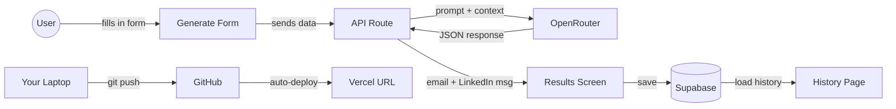

# BuildDay Student Manual

**What we're building:** An AI-powered Sales outreach generator  
**Duration:** 9:00am -- 3:30pm (doors open 8:30am)

---

## Before You Arrive

Complete these steps before the workshop (about 10 minutes):

1. **Install Cursor** -- go to cursor.com, download and install it, and sign up for a Pro subscription (or start a free trial)
2. **Create these accounts** (all free):
  - **GitHub** -- github.com
  - **Vercel** -- vercel.com (sign up with your GitHub account)
  - **Supabase** -- supabase.com, then also go to supabase.com/dashboard/account/tokens, click "Generate new token", name it "Cursor MCP", and save the token somewhere safe
  - **OpenRouter** -- openrouter.ai (add $5 credit -- this will last you weeks beyond the workshop)

That's it. We'll handle the rest on the day.

Stuck? Reply to the setup email and we'll sort it out before the day.

---

## When You Arrive (Doors Open 8:30am)

Grab a coffee, connect to wifi, and open Cursor. Then open a new agent chat (Cmd+L on Mac, Ctrl+L on Windows) and paste this prompt:

WIFI:

username: "StoneAndChalk"  
password: "stoneandresident"

```
Check if Node.js and Git are installed on this machine.
If Node.js is not installed, install it using Homebrew (install Homebrew first
if needed on Mac, or download from nodejs.org on Windows).
If Git is not installed, install it using Homebrew (Mac) or download from
git-scm.com (Windows).
Tell me the version of each when done.
```

Wait for the agent to finish. If it reports version numbers for both Node.js and Git, you're ready. If anything fails, grab a facilitator and we'll sort it out before we start at 9:00am.

---

## The Tech Stack

Here's what each tool does, in plain English:


| Tool           | What it does                                                                                                                             |
| -------------- | ---------------------------------------------------------------------------------------------------------------------------------------- |
| **Cursor**     | Your AI building partner. You describe what you want in English, it writes the code.                                                     |
| **Next.js**    | The framework -- the structure your app is built on. Like the framing of a house.                                                        |
| **Supabase**   | Your database -- where your app stores information. Like a spreadsheet your app can read and write to.                                   |
| **MCP**        | The bridge -- lets Cursor talk directly to Supabase, so the agent can create tables and manage your database without you leaving Cursor. |
| **GitHub**     | Your save file -- keeps a history of every version of your code. Like Google Docs version history.                                       |
| **Vercel**     | Your hosting -- puts your app on the internet so anyone can visit it.                                                                    |
| **OpenRouter** | Your AI access -- one key that connects to any AI model (Claude, GPT, etc.)                                                              |


---

## Three Habits That Will Save You

Keep these in mind throughout the day:

1. **The Checkpoint Rule** -- Before we start anything new, we commit and push to GitHub. It's a save point. If the next thing breaks, we go back to here.
2. **The Reset Rule** -- If Cursor starts spiralling (fixing one thing and breaking another), we stop, revert to the last checkpoint, and try a different prompt. We never chase a fix spiral.
3. **One thing at a time** -- We never ask Cursor to do five things at once. One feature, one prompt, one test.

---

## What We're Building

Our app does one thing: you type in who you're reaching out to and why, and it gives you a personalised cold email and LinkedIn message.

### Why this app?

This project is deliberately simple, but it covers every fundamental skill you need to build real software:

- **A frontend UI** -- the form and results screens are what the user actually sees and interacts with. Every app starts here.
- **An AI integration** -- the app sends a request to an AI provider (OpenRouter), receives structured data back, and does something useful with it. This is the same pattern behind every AI-powered product.
- **A database** -- the app writes data to Supabase and reads it back. Storing and retrieving information from a permanent data store is the backbone of any application that remembers anything. This is effectively google sheets or microsoft excel, and infact those software packages can even be used as a data store.
- **Version control** -- pushing code to GitHub means your work is backed up in the cloud and you can always go back to a previous version. This is how every professional development team works. It also means if your laptop blows up, you can just get a new laptop and connect to github and continue on from where you left it. Github is like a library or a book, it stores your code, but it doesn't run your code.
- **Deployment** -- connecting to Vercel takes your app from "running on my laptop" to "live on the internet with a real URL." This is the step most people skip when learning, and it's the step that makes everything real. Vercel runs ontop of AWS and is effectively an 'always on computer' that runs your code just like localhost:3000 does on your local machine.

By the end of the day you'll have touched every layer of a modern web application. The app itself is useful, but the real value is understanding how these pieces fit together -- because every app you build after this uses the same architecture.

### How it all fits together




**The flow:**

1. A user visits your Vercel URL and fills in the form -- prospect name, company, role, what you offer, their pain point
2. The app sends that data to an API route, which forwards it to OpenRouter with the prompt
3. The AI model generates a personalised cold email and LinkedIn message and returns them as JSON
4. The results appear on screen with copy buttons
5. Clicking "Save to History" writes everything to Supabase
6. The History page reads from Supabase and displays all saved entries

Your code gets from your laptop to the internet via GitHub (storage) and Vercel (hosting). Every time you push to GitHub, Vercel automatically redeploys.

**Three screens:**

- **Generate** -- a form where you enter the prospect's details
- **Results** -- displays the AI-generated email and LinkedIn message
- **History** -- shows all your saved outreach entries

**The database:**

```
Table: outreach
-----------------------------------------
id              | uuid (auto-generated)
prospect_name   | text
company         | text
role            | text
offer           | text
pain_point      | text
email_subject   | text
email_body      | text
linkedin_message| text
created_at      | timestamp (auto-generated)
-----------------------------------------
```

- The first five columns are what you type in (inputs)
- The next three are what the AI generates (outputs)
- The last two are automatic (the database handles them)

 **do :**

```
You are an expert B2B copywriter.

Write two pieces of outreach copy for the following context:

Prospect: [name] -- [role] at [company]
What we offer: [your_offer]
Their likely pain point: [pain_point]

Output:
1. A cold email with a subject line. Keep it under 150 words.
   Conversational, not salesy. End with one clear CTA.
2. A LinkedIn connection message. Under 300 characters.
   Warm, human, specific.

Format your response as JSON:
{
  "email_subject": "",
  "email_body": "",
  "linkedin_message": ""
}
```

---

## Build Order

This is the checklist for the day. After every step, we commit and push to GitHub.

```
1. Create the Next.js project + connect to GitHub       → CHECKPOINT
2. Build the Generate form (5 fields + button)           → CHECKPOINT
3. Set up Supabase (MCP + table + secret keys)           → CHECKPOINT
4. Build the API route (connect form to OpenRouter)      → CHECKPOINT
5. Build the Results screen (email + LinkedIn display)   → CHECKPOINT
6. Add "Save to History" (write to Supabase)             → CHECKPOINT
7. Build the History page (read from Supabase)           → CHECKPOINT
8. Deploy to Vercel                                      → CHECKPOINT (final)
```

---

## Step 1: Create the Project + Connect to GitHub

### Create the project

1. Open Cursor
2. Open a new agent chat (Cmd+L on Mac, Ctrl+L on Windows)
3. Type this prompt:

```
Create a new Next.js project called "outreach-generator" on my Desktop.
Use TypeScript, Tailwind CSS, and the App Router.
After creating it, open the project folder and start the dev server.
```

1. Wait for the agent to finish
2. Start the app by prompting it with `start the app` . Then open your browser to [http://localhost:3000](http://localhost:3000) -- that's your app running

### Key files to know

- `app/page.tsx` -- this is what you see in the browser. We'll replace it.
- `app/layout.tsx` -- this wraps every page. Think of it as the frame around every screen.
- `.env.local` -- this is where we'll put our secret keys. This file never gets uploaded to GitHub.

### Connect to GitHub

1. Go to github.com and create a new repository
  - Name: `outreach-generator`
  - Visibility: Private
  - Do NOT add a README (we already have one)
2. Copy the repository URL
3. In Cursor's agent chat:

```
Commit all current changes with the message "initial project setup".
Then add a git remote called "origin" pointing to <paste-your-github-url>
and push to the main branch.
```

1. Refresh GitHub in your browser -- your code should be there

---

## Step 2: Build the Generate Form

In Cursor's agent chat:

```
Replace the contents of app/page.tsx with a clean outreach email generator form.

The form should have these fields:
- Prospect Name (text input)
- Company (text input)
- Their Role (text input)
- Your Offer / What You Do (textarea)
- Pain Point / Reason for Reaching Out (textarea)

And a large "Generate" button at the bottom.

Use Tailwind CSS for styling. Make it look professional -- centered on the page,
clean spacing, subtle shadows. The page title should be "Outreach Generator".

The form should not submit yet -- just build the UI.
```

Review and accept the changes. Check the browser -- the form should be there.

**CHECKPOINT:** In the agent chat: `Commit all changes with the message 'add generate form' and push to GitHub`

---

## Step 3: Set Up Supabase + MCP + Secret Keys

### Part A: Create the Supabase project

1. Go to supabase.com
2. Create a new project
  - Name: `outreach-generator`
  - Region: closest to you
  - Generate a password and save it somewhere
3. Wait for the project to provision (~2 minutes)

### Part B: Connect the Supabase MCP server to Cursor

MCP lets Cursor's agent talk directly to your Supabase database. Instead of manually creating tables through the website, the agent can do it for you.

1. Go to supabase.com/dashboard/account/tokens
2. Click **Generate new token**, name it "Cursor MCP", and copy the token immediately (you can only see it once)
3. In Cursor, open Settings (Cmd+Shift+J on Mac, Ctrl+Shift+J on Windows)
4. Click **MCP** in the left sidebar (under Features)
5. Click **Add new MCP server**
6. Fill in:
  - **Name:** `supabase`
  - **Type:** `command`
  - **Command:** `npx -y @supabase/mcp-server-supabase@latest --access-token <paste-your-token-here>`
7. Save and wait for the green dot to appear next to "supabase"

If you see a red dot, click the refresh button. If it persists, double-check your access token.

### Part C: Create the database table

In Cursor's agent chat:

```
Using Supabase MCP, create a table called "outreach" in my Supabase project
with the following columns:

- id: uuid, primary key, default gen_random_uuid()
- prospect_name: text
- company: text
- role: text
- offer: text
- pain_point: text
- email_subject: text
- email_body: text
- linkedin_message: text
- created_at: timestamptz, default now()

Disable Row Level Security on this table for now.
```

After it completes, check your Supabase dashboard (Table Editor) to verify the table is there.

### Part D: Set up environment variables

1. In Supabase, go to **Settings** then **API** -- copy the **Project URL** and **anon key**
2. Go to openrouter.ai, then **Keys** -- copy your API key
3. In Cursor's agent chat:

```
Set up Supabase and environment variables in this project:

1. Create a .env.local file with these values:
   NEXT_PUBLIC_SUPABASE_URL=<paste-your-supabase-url>
   NEXT_PUBLIC_SUPABASE_ANON_KEY=<paste-your-anon-key>
   OPENROUTER_API_KEY=<paste-your-openrouter-key>

2. Install the @supabase/supabase-js package

3. Create a file at lib/supabase.ts that creates and exports a Supabase client
   using those environment variables
```

After this, restart the dev server so Next.js picks up the new environment variables. In the agent chat: `Stop the dev server and start it again`

**CHECKPOINT:** In the agent chat: `Commit all changes with the message 'set up supabase and env vars' and push to GitHub`

---

## Step 4: Build the API Route + AI Integration

In the agent chat:

```
I need to add AI-powered email generation to this app. Do the following:

1. Create a Next.js API route at app/api/generate/route.ts that:
   - Accepts a POST request with JSON body containing:
     prospect_name, company, role, offer, pain_point
   - Calls the OpenRouter API (https://openrouter.ai/api/v1/chat/completions)
     using the OPENROUTER_API_KEY environment variable
   - Uses the model "anthropic/claude-sonnet-4-20250514"
   - Sends this system prompt: "You are an expert B2B copywriter. Always
     respond with valid JSON only, no markdown."
   - Sends a user prompt that includes all five fields and asks for a cold
     email (subject + body, under 150 words, conversational, one clear CTA)
     and a LinkedIn message (under 300 characters, warm and specific)
   - Requests the response in JSON format:
     { "email_subject": "", "email_body": "", "linkedin_message": "" }
   - Parses the JSON from the AI response and returns it
   - Uses fetch, not axios. Includes error handling.

2. Update app/page.tsx so that when the Generate button is clicked:
   - POST the form data to /api/generate
   - Show a loading state on the button while waiting ("Generating...")
   - When the response comes back, store the result in state
   - For now, just console.log the result -- we'll display it properly next
```

### Test it

1. Fill in the form with a real prospect
2. Hit Generate
3. Open browser DevTools (Cmd+Option+J on Mac, Ctrl+Shift+J on Windows)
4. Check the console -- you should see a JSON object with `email_subject`, `email_body`, and `linkedin_message`

If it works -- you just built an AI feature.

**CHECKPOINT:** In the agent chat: `Commit all changes with the message 'add AI generation via openrouter' and push to GitHub`

---

## Step 5: Build the Results Screen

In the agent chat:

```
Update app/page.tsx so that when the AI response comes back, instead of
console.log, display the results below the form:

Show two cards side by side:
1. "Cold Email" card -- show the subject line in bold, then the body below it.
   Include a "Copy" button that copies the full email to clipboard.
2. "LinkedIn Message" card -- show the message. Include a "Copy" button.

Below both cards, show two buttons:
- "Regenerate" (calls the API again with the same inputs)
- "Save to History" (we'll wire this up next)

Use Tailwind CSS. Make the cards look clean with borders and padding.
```

**CHECKPOINT:** In the agent chat: `Commit all changes with the message 'display results with copy buttons' and push to GitHub`

---

## Step 6: Save to Supabase

In the agent chat:

```
Update the "Save to History" button in app/page.tsx to:

1. When clicked, insert a row into the Supabase "outreach" table with all the
   form inputs (prospect_name, company, role, offer, pain_point) AND the AI
   outputs (email_subject, email_body, linkedin_message)
2. Use the Supabase client from lib/supabase.ts
3. Show a success message ("Saved!") that disappears after 2 seconds
4. Disable the button after saving so they don't accidentally save twice

Import the supabase client at the top of the file.
```

### Test it

1. Generate an email
2. Hit "Save to History"
3. Go to your Supabase dashboard, then Table Editor, then the outreach table
4. Your data should be there

**CHECKPOINT:** In the agent chat: `Commit all changes with the message 'save to supabase' and push to GitHub`

---

## Step 7: Build the History Page

In the agent chat:

```
Create a new page at app/history/page.tsx that:

1. On load, fetches all rows from the Supabase "outreach" table, ordered by
   created_at descending (newest first)
2. Displays them in a clean table with columns: Prospect Name, Company,
   Date (formatted nicely)
3. Each row is clickable -- when clicked, it expands to show the full email
   and LinkedIn message below the row, with copy buttons
4. Include a link back to the main page ("Generate New")

Also update the main page (app/page.tsx) to include a link to /history
("View History") in the top right corner.

Use Tailwind CSS. Keep it simple and clean.
```

### Test it

1. Go to /history in the browser
2. The entry you saved earlier should appear
3. Click it -- the full email and LinkedIn message should expand
4. Go back to the main page, generate a new one, save it, check history -- both should be there

**CHECKPOINT:** In the agent chat: `Commit all changes with the message 'add history page' and push to GitHub`

---

## Step 8: Polish (Optional)

Pick one or two things to improve and ask Cursor to do them:

- Add a navigation bar with links between Generate and History
- Improve the colour scheme or add a logo placeholder
- Add placeholder text in the form fields (examples of what to type)
- Add a character count to the LinkedIn message field
- Make it mobile-responsive

**CHECKPOINT:** In the agent chat: `Commit all changes with the message 'polish and styling' and push to GitHub`

---

## Step 9: Deploy to Vercel

This is where your app goes live on the internet.

1. Go to vercel.com, then **Add New**, then **Project**
2. **Import from GitHub** and select `outreach-generator`
3. Before deploying, add these **environment variables** (copy them from your `.env.local` file):
  - `NEXT_PUBLIC_SUPABASE_URL`
  - `NEXT_PUBLIC_SUPABASE_ANON_KEY`
  - `OPENROUTER_API_KEY`
4. Click **Deploy**
5. Wait ~2 minutes for the build to finish
6. Click the URL Vercel gives you -- that's your app, live on the internet

### Test the live app

- Open the URL on your phone
- Generate an email
- Save it to history
- Check the history page
- Verify the data appears in your Supabase dashboard

If something doesn't work:

- **App loads but AI doesn't work** -- you probably forgot to add `OPENROUTER_API_KEY` in Vercel's environment variables
- **App won't build** -- read the error log in Vercel. It's usually a TypeScript error. Fix it in Cursor, commit, push, and Vercel will automatically redeploy

---

## What Comes Next

You've built a fully working app. It's live, it generates real output, and it saves to a real database. But there are things we deliberately left out because they're beyond what we can do in six hours. Here's what you'd add next:

1. **Authentication** -- right now, anyone with the URL can use it. Adding login (Supabase Auth) means each person only sees their own data.
2. **Security** -- we turned off Row Level Security on the database. Before sharing this with others, you'd turn that back on and set rules for who can read and write data.
3. **Rate limiting** -- right now, someone could hit your Generate button 10,000 times and burn through your OpenRouter credits. You'd add limits.
4. **Error handling** -- what happens if OpenRouter is down? If the internet drops? Production apps handle these gracefully.
5. **Custom domain** -- right now it's on a `.vercel.app` URL. You can connect your own domain in Vercel's settings.

These aren't scary -- they're the next steps. You now understand the architecture well enough to ask Cursor to help you add them.

---

## Quick Reference

### Useful Cursor shortcuts


| Shortcut                                   | What it does         |
| ------------------------------------------ | -------------------- |
| Cmd+L (Mac) / Ctrl+L (Windows)             | Open agent chat      |
| Cmd+Shift+J (Mac) / Ctrl+Shift+J (Windows) | Open Cursor settings |
| Ctrl+`                                     | Open the terminal    |


### Checkpoint prompt

Copy and paste this every time, changing the message:

```
Commit and push all changes
```

### Reset Rule prompt

If something breaks and you want to go back to the last checkpoint:

```
Revert all uncommitted changes back to the last commit
```

Then start a new agent chat and try again with a clearer prompt.

### Your secret keys

Keep these somewhere safe -- you'll need them for Vercel deployment:


| Key                                      | Where to find it                            |
| ---------------------------------------- | ------------------------------------------- |
| `NEXT_PUBLIC_SUPABASE_URL`               | Supabase dashboard, then Settings, then API |
| `NEXT_PUBLIC_SUPABASE_ANON_KEY`          | Supabase dashboard, then Settings, then API |
| `OPENROUTER_API_KEY`                     | openrouter.ai, then Keys                    |
| Supabase personal access token (for MCP) | supabase.com/dashboard/account/tokens       |


---

## Schedule


| Time    | What's happening                                                                           |
| ------- | ------------------------------------------------------------------------------------------ |
| 8:30am  | Doors open -- coffee, wifi, setup check                                                    |
| 9:00am  | Welcome, introductions, demo of the finished app                                           |
| 9:30am  | Plan like a developer -- scope, database, AI prompt                                        |
| 10:15am | Coffee break                                                                               |
| 10:30am | Build session 1 -- project setup, GitHub, form, Supabase MCP                               |
| 12:00pm | Lunch                                                                                      |
| 12:45pm | Build session 2 -- AI integration, results display, save to database, history page, polish |
| 2:30pm  | Deploy to Vercel                                                                           |
| 3:00pm  | Demos and what comes next                                                                  |
| 3:20pm  | Wrap up                                                                                    |


